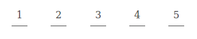
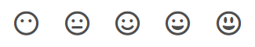

# Emoji Feedback

A simple package for content feedback

## How to use

Style

```html
<link rel="stylesheet" href="dist/css/emoji-feedback.css">
```
OR
```html
<link rel="stylesheet" href="https://raw.githubusercontent.com/jacsonsantos/emoji-feedback/master/dist/css/emoji-feedback.css">
```

Script

```html
<script src="dist/js/emoji-feedback.js"></script>
```
OR
```html
<script src="https://raw.githubusercontent.com/jacsonsantos/emoji-feedback/master/dist/js/emoji-feedback.js"></script>
```


HTML

```html
<div class="feedback"></div>
```

### Getting started

```javascript
let option = {
    items: [
       {name: 1, value: 1},
       {name: 2, value: 2},
       {name: 3, value: 3},
       {name: 4, value: 4},
       {name: 5, value: 5}
    ],
    url: `${location.origin}/feedback`
};

let feedback = new Feedback();
feedback.option(option);
feedback.show();
```
**Result**



**Option**

| param  | description  |
|---|---|
|  items |  List of object with *name* and *value* |
|  url | Endpoint for request POST   |
|  type | Type: *default* or *fontawesome*  |
|  request | Function  |
|  response | Function  |

### Using Fontawesome

```javascript
let option = {
    type: 'fontawesome',
    items: [
       {name: 'fa-meh-blank', value: 1},
       {name: 'fa-meh', value: 2},
       {name: 'fa-smile ', value: 3},
       {name: 'fa-grin', value: 4},
       {name: 'fa-grin-alt', value: 5}
    ],
    url: `${location.origin}/feedback`
};

let feedback = new Feedback();
feedback.option(option);
feedback.show();
```
**Result**

